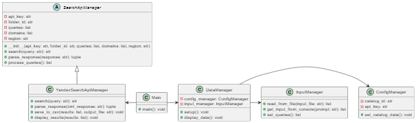

### README
## задача

Цель: узнать долю сайтов, например, vk.com (m.vk.com), rutube.ru, dzen.ru в поисковой выдаче в топ1, топ3, топ5 и топ10 по брендовым запросам, используя Yandex Search API.

Что хочется видеть: 
•⁠  ⁠скрипт/приложение/tg-бот, где на входе подается: 
  1)csv/txt файл с запросами или строка 
  2)ключ к API. 
  3)домен/домены по которым мы смотрим позиции. На выходе csv/txt файл с позициями домена по запросу. 
•⁠  ⁠описание как работает ваш «сервис».
•⁠  ⁠что можно улучшить, если затратить больше времени.

## содержание:
1) постановка задачи
2) описание решения
3) способы улучшения
4) Что не так с ПО
5) время

## сервис

Этот сервис позволяет работать с API Яндекса для выполнения поисковых запросов и анализа результатов. Пользователь вводит запросы и домены для анализа, а сервис собирает данные о позициях заданных доменов в результатах поиска.

---

# Возможности

1. **Работа с API Яндекса**:
   - Выполнение запросов через Yandex Search API.
2. **Анализ доменов**:
   - Определение позиций доменов (Top 1, Top 3, Top 5, Top 10).
3. **Гибкость ввода**:
   - Запросы и домены можно вводить вручную или загружать из файлов.
4. **Сохранение результатов**:
   - Итоги работы сохраняются в CSV-файл.

---
# Классы



**Вот список классов:**
- **ConfigManager** управляет API-ключом и идентификатором каталога.
- **InputManager**  обрабатывает ввод данных: чтение из файла или консоли.
- **DataManager**   управляет данными, объединяя конфигурацию и ввод запросов/доменов.
- **SearchApiManager**  абстрактный класс для работы с API.
- **YandexSearchApiManager**  реализует запросы к API Яндекса и обработку ответов.
- **Main**  связывает все классы и запускает процесс.
---

# Установка и запуск

1. Убедитесь, что у вас установлен Python версии 3.8 или выше.
2. Установите зависимости:
   ```bash
   pip install requests
   ```
3. Скачайте файлы проекта в одну папку.
4. Для запуска выполните команду:
   ```bash
   python main.py
   ```

---

# Использование

1. **Ввод данных**:
   - При запуске программа запросит идентификатор каталога и API-ключ.
   - Далее предложит ввести запросы и домены:
     - Вручную (через консоль).
     - Из файла (укажите путь).
2. **Сохранение результатов**:
   - Программа сохранит данные анализа в CSV-файл. Вы укажете имя файла при завершении работы.

---

# Формат файлов

- **Файл с запросами**:
  - Один запрос на строку.
  ```txt
  купить телефон
  лучшие ноутбуки
  ```
- **Файл с доменами**:
  - Один домен на строку.
  ```txt
  example.com
  mysite.ru
  ```

---

## Что можно было бы улучшить?
добавить/реализовать:
1. Создание чат-бота
2. Добавить GUI (графический интерфейс) с помощью PyQt, Tkinter
3. Интеграция с библиотеками, такими как Matplotlib или Plotly, для отображения графиков позиций доменов.
4. Добавить систему логирования с помощью модуля logging, чтобы фиксировать ошибки, действия пользователя и этапы выполнения
5. Написать автотесты для всех модулей, чтобы повысить надежность.
6. Создание отчетов в форматах Excel, PDF или HTML для удобного обмена результатами.
7. Сохранение данных в облаке
8. Более детализированное управление исключениями с выводом подсказок пользователю.

---

## Что не так с ПО

1. архитектура не проработана
2. не проработан процесс ловли ошибок
3. функции имеют могут иметь несколько точек выхода(лучше было бы объявить переменную хранения значения и возвращать его один раз)
4. можно было бы упростить код для его читабельности 
5. пользовательский ввод "немнго" запутан

---

## затраченно времени 

| **время ч**            | **задача**                                                                 |
|---------------------------|-----------------------------------------------------------------------------|
| 3                   | написание программного кода                       |
| 0.5       | документирование                                    |
| 1       | работа с yandex search api                       |
| 0.5               | устранение проблем .                |
| ---     | ---                                |
| 5 ч + время дополнительного изучения | итого                     |

